# Start Vue.js By Visual Stduio Code

# 1. 필수 요소 설치
### 1.1 Visual Studio Code 설치
https://code.visualstudio.com/

### 1.2 NPM설치, Long Term Support 버전 권장.
https://nodejs.org/en/

### 1.3. git 설치(언급은 안되고 필수는 아니지만 ㅎㅎ)
https://git-scm.com/

# 2. Visual Studio Code Setting

### 2.1 Visual Studio Code 열기
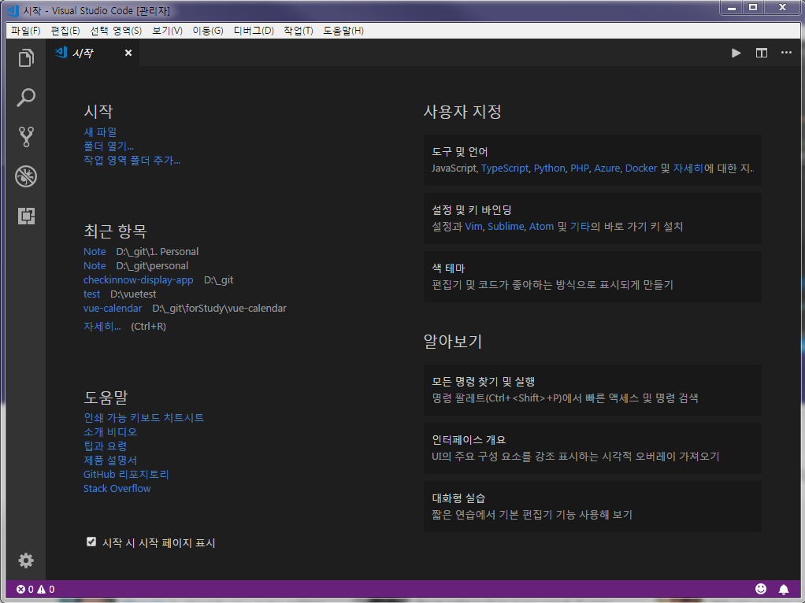

### 2.2 마켓에서 필요한 리소스 각자 다운받기.
참고하기 좋은 자료
-->> https://www.shopify.com/partners/blog/best-visual-studio-code-extensions-2017

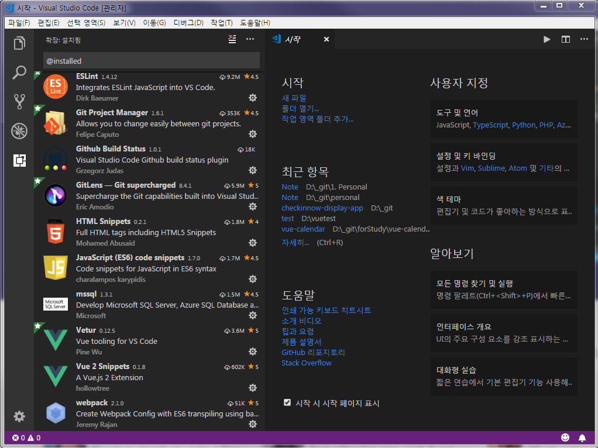

# 3. NPM에서 Vue.js 에 필요한 기본 적인 요소 설치하기.

### 3.1 NPM 설치 되어있는지 확인하기.
> **정상적으로 설치되어있는지 알아보기위해 명령 프롬포트에서(CMD) npm --version**
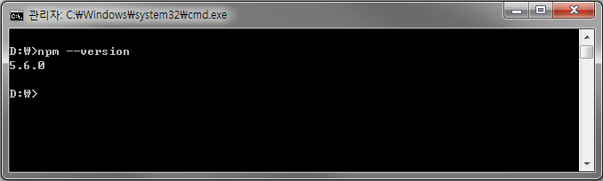

> **npm 에서 글로벌로 설치할만한 모듈들을 설치하자.**

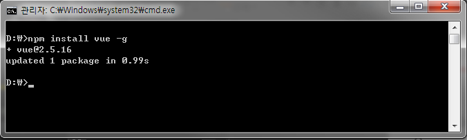
- webpack
    - 명령어 : **npm install webpack -g**
    - Code Splitting, Hot Reloading, Long Term Caching 등등

- Vue
    - 명령어 : **npm install vue -g**
    - 대규모 빌드 권장방식 및 WebPack을 사용 하기위함(NPM)

- vue-cli
    - 명령어 : **npm install vue-cli@2.9.3 -g**
    - 2.9.3은 개인적인 사내 권장 템플릿 버전
    - https://cli.vuejs.org/guide/creating-a-project.html#using-the-gui

- 만약, 아래 인스톨 과정 및 네트워크 동작 작업시에 회사의 사내 네트워크 문제로 막혀있을때는..
- 명령어 : **npm config set strict-ssl false**
- 혹은
- 명령어 : **set npm_config_strict_ssl=false**

### 3.2 설치된 NPM 글로벌 리스트 확인해보기.

**npm list -g --depth=0**

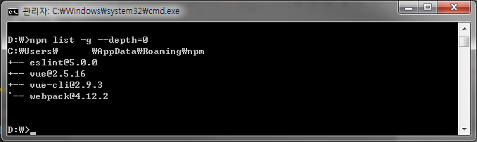

# 4. Vue 기본 템플릿을 설치 및 Open It

### 4.1 원하는 경로에 Vue-cli 로 템플릿 설치.
    - 명령 커맨드창에서 원하는 경로로 이동
**vue init webpack-simple {지정이름}**

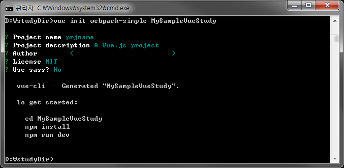

### 4.2 원하는 경로에 정상적으로 설치되었는지 확인

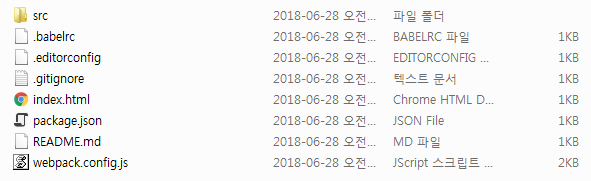

### 4.3 Visual Studio Code 로 생성된 프로젝트 열기

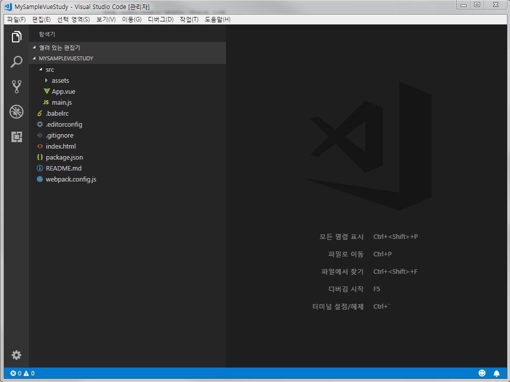

### 4.3 Visual Studio Code 에서 해당 프로젝트의 Node_Module 다운로드

- 4.3.1 단축키 : ctrl + '  (터미널열기)
- 4.3.2 명령어 : **npm install** (해당 프로젝트 경로로 설정되어있는지 확인 후 진행)
- npm 에서 해당 샘플 프로젝트 내 package.json 속, 필요한 모듈들을 다운로드 한다.
    -  Package.json 을 통한 모듈 다운로드는 Java 의 Maven / .Net 의 Nuget 혹은 config 속 필요 dll 다운로드와 비슷한 개념.

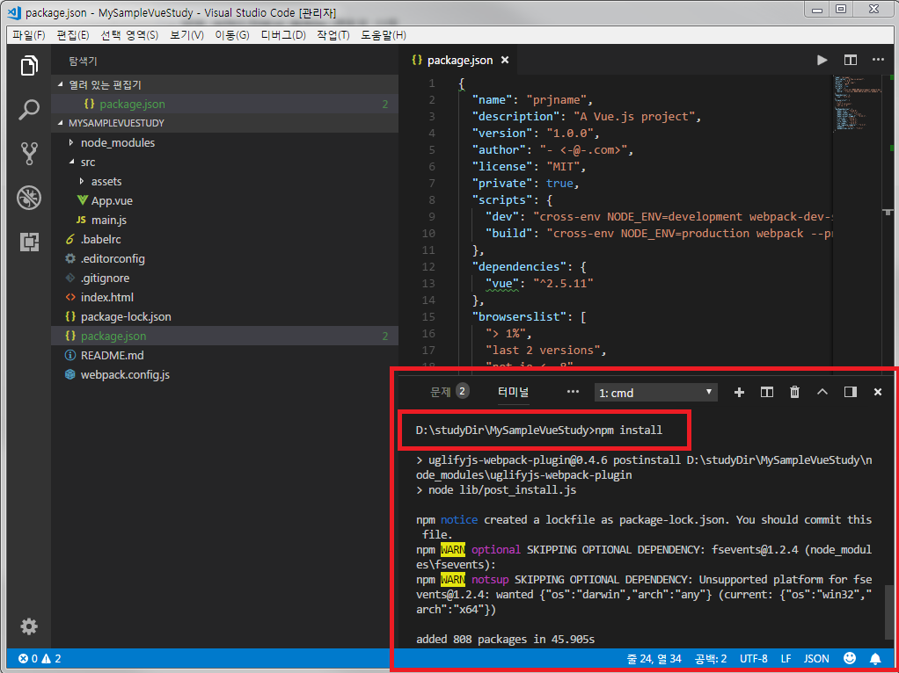

### 4.4 Hello World 실행 해보기.
- 4.4.1 단축키 : ctrl + '  (터미널열기)
- 4.4.2 명령어 : **npm run dev**
- npm 에서 필요한 설정된 webpack 및  package.json 설정 정보를 기준으로, node.js 서버를 구동시켜 localhost 상에 화면을 띄우게된다.

- 4.4.3 실행
    - 실행 과정
        - 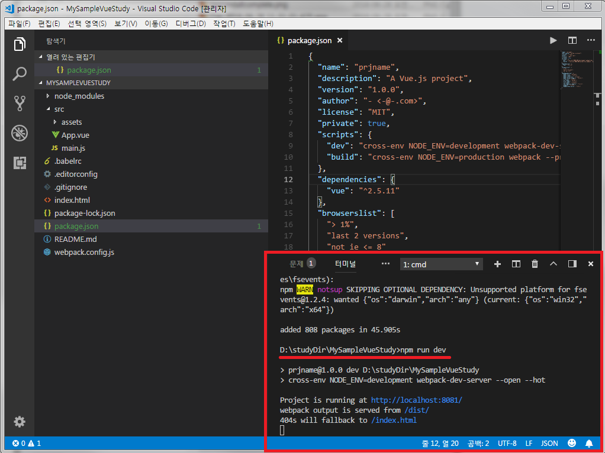
    - 실행된 화면
        - 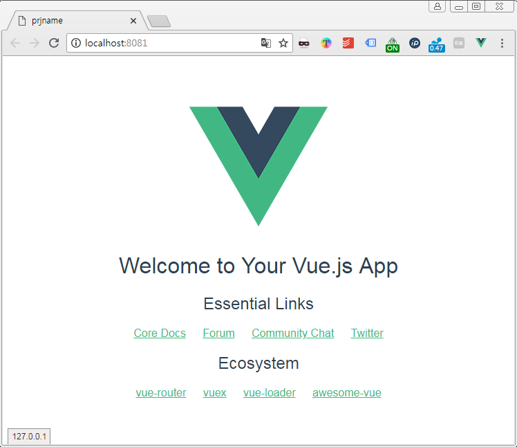
